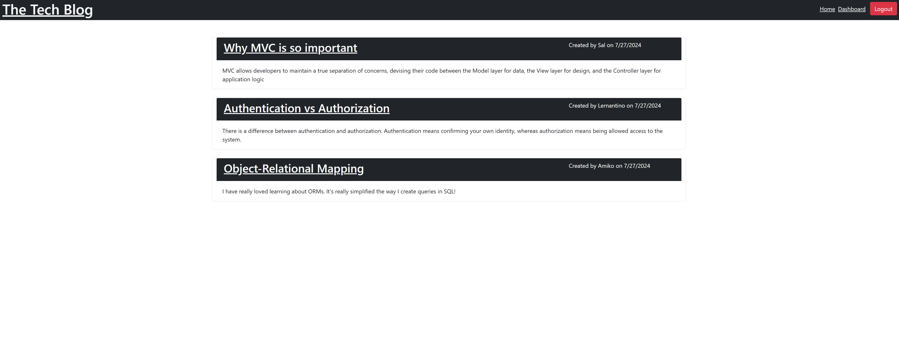
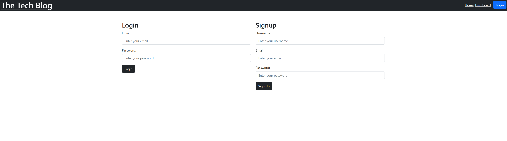
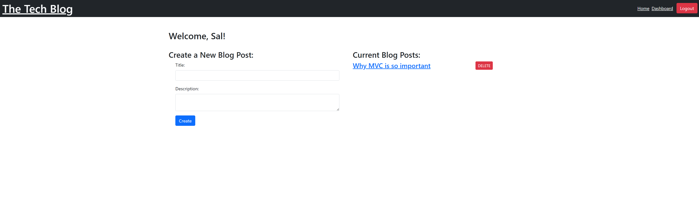
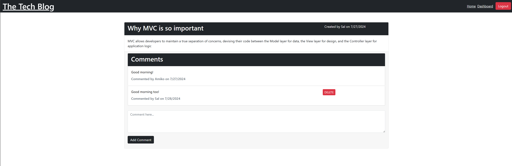

  # 14 The Tech Blog

  ## Description

    This tech blog has been developed using express, sessions, bcrypt, sequalize, and handlebars. Certain routes are closed off from non members and require signing up before adding blog posts and/or commenting.

  ## Table of Contents 

  - [Installation](#installation)
  - [Usage](#usage)
  - [Screenshots](#screenshots)
  - [License](#license)

  ## Installation

    Create a .env and populate it with your credentials as DB_NAME='' DB_USER='' and DB_PASSWORD=''. Open a terminal, run npm install. Go to the db folder and  login with psql -U #username and run the sql file using the command \i schema.sql. Return to the root folder then run npm run seed and npm run start.

  ## Usage

    Login using the pre-populated user credentials inside userData.json or sign up. You will be directed to your profile page where you can make a blog post as well as delete them. Click on the title of the blog post from either the homepage or your profile to comment. Add or remove comments as necessary. Only homepage is accessible if not logged in.

  ### Deployed link
  
  [Click Here](https://one4-tech-block.onrender.com)
  
  ## Screenshots

    This is the homepage.
  

    This is the login page.
  

    This is the profile/ dashboard page.
  

    This is the blog post page.
  

  ## License 
  ### Badge 
  

    
      MIT License

      Copyright (c) function getFullYear() { [native code] } 
      
      Permission is hereby granted, free of charge, to any person obtaining a copy
      of this software and associated documentation files (the "Software"), to deal
      in the Software without restriction, including without limitation the rights
      to use, copy, modify, merge, publish, distribute, sublicense, and/or sell
      copies of the Software, and to permit persons to whom the Software is
      furnished to do so, subject to the following conditions:
      
      The above copyright notice and this permission notice shall be included in all
      copies or substantial portions of the Software.
      
      THE SOFTWARE IS PROVIDED "AS IS", WITHOUT WARRANTY OF ANY KIND, EXPRESS OR
      IMPLIED, INCLUDING BUT NOT LIMITED TO THE WARRANTIES OF MERCHANTABILITY,
      FITNESS FOR A PARTICULAR PURPOSE AND NONINFRINGEMENT. IN NO EVENT SHALL THE
      AUTHORS OR COPYRIGHT HOLDERS BE LIABLE FOR ANY CLAIM, DAMAGES OR OTHER
      LIABILITY, WHETHER IN AN ACTION OF CONTRACT, TORT OR OTHERWISE, ARISING FROM,
      OUT OF OR IN CONNECTION WITH THE SOFTWARE OR THE USE OR OTHER DEALINGS IN THE
      SOFTWARE.
      

  https://choosealicense.com/licenses/mit/
  

  